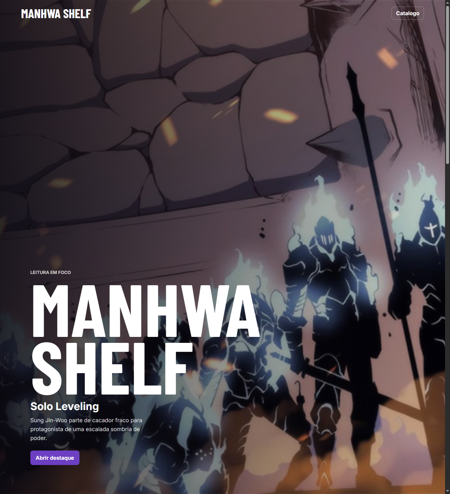
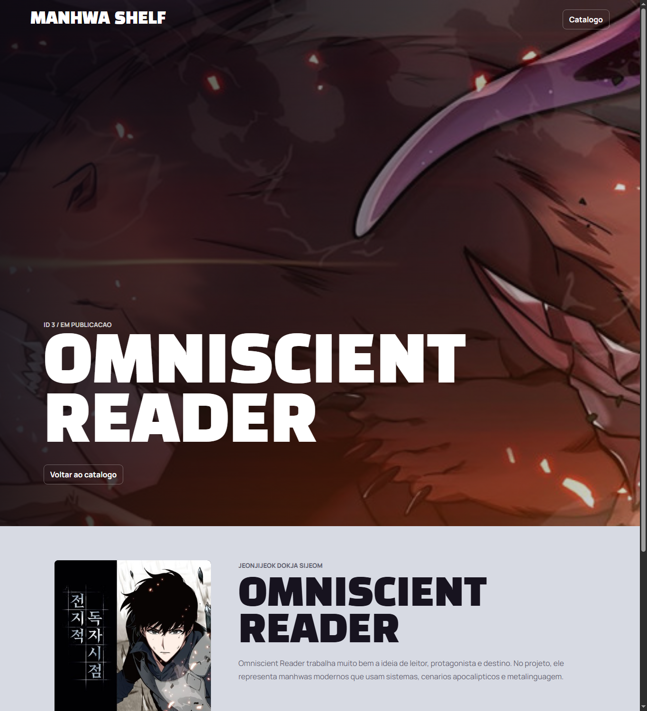

# Trabalho Pratico - Semana 11

Projeto desenvolvido para a atividade de paginas de detalhes dinamicas.

## Informacoes Gerais

- Nome: Gabriel Dario Matos Clemente
- Matricula: 928004
- Descreva brevemente seu projeto: catalogo de manhwas coreanos populares com pagina inicial dinamica e pagina de detalhes carregada por query string.

O projeto mostra uma pagina inicial com cards montados por JavaScript a partir de uma estrutura JSON. Ao clicar em um card, o usuario e direcionado para `detalhes.html?id=...`, onde a mesma pagina de detalhes carrega as informacoes do item selecionado pela query string.

## Estrutura do projeto

- `public/index.html`: pagina inicial.
- `public/detalhes.html`: pagina unica de detalhes.
- `public/app.js`: dados em JSON e funcoes de renderizacao.
- `public/styles.css`: estilos e responsividade.
- `public/img/`: imagens usadas nos cards e detalhes.
- `tests/app.test.js`: testes unitarios das funcoes principais.

## Prints do trabalho

### Home-page



### Tela de detalhes



## Dados em JSON

Trecho da estrutura definida em `public/app.js`:

```json
{
  "manhwas": [
    {
      "id": 1,
      "title": "Solo Leveling",
      "originalTitle": "Na Honjaman Level Up",
      "description": "Sung Jin-Woo parte de cacador fraco para protagonista de uma escalada sombria de poder.",
      "genre": "Acao, aventura, fantasia",
      "status": "Finalizado",
      "year": 2018,
      "chapters": 201,
      "score": 84,
      "author": "Chugong",
      "coverImage": "img/solo-leveling.jpg",
      "bannerImage": "img/solo-leveling-banner.jpg",
      "highlight": true
    },
    {
      "id": 3,
      "title": "Omniscient Reader",
      "originalTitle": "Jeonjijeok Dokja Sijeom",
      "description": "Kim Dokja conhece o roteiro de um mundo que virou realidade porque leu a obra ate o final.",
      "genre": "Acao, aventura, fantasia",
      "status": "Em publicacao",
      "year": 2020,
      "chapters": "Em andamento",
      "score": 86,
      "author": "Sing Shong",
      "coverImage": "img/omniscient-reader.jpg",
      "bannerImage": "img/omniscient-reader-banner.jpg",
      "highlight": true
    }
  ]
}
```

## Como abrir

Abra `public/index.html` no navegador ou execute um servidor local:

```bash
python -m http.server 8091 -d public
```

Depois acesse:

```text
http://localhost:8091/index.html
```

## Como testar

```bash
npm.cmd test
```
